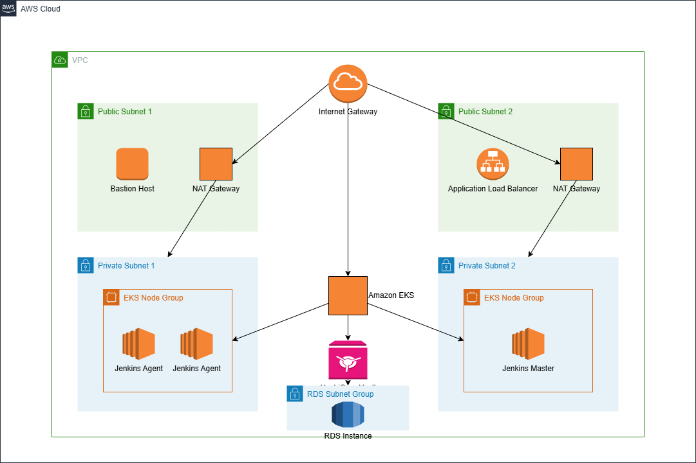
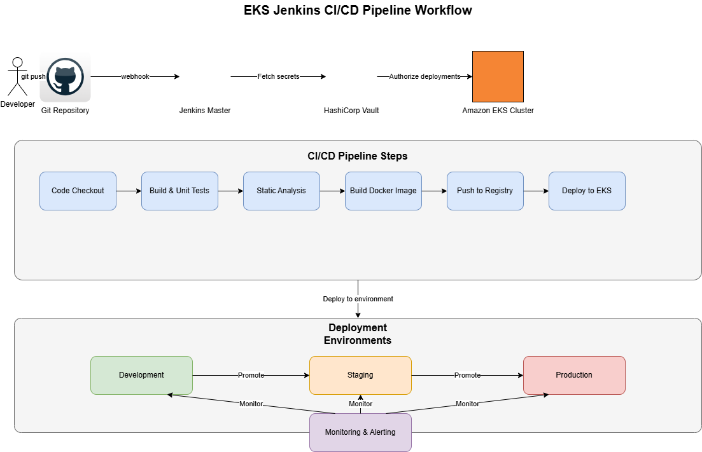
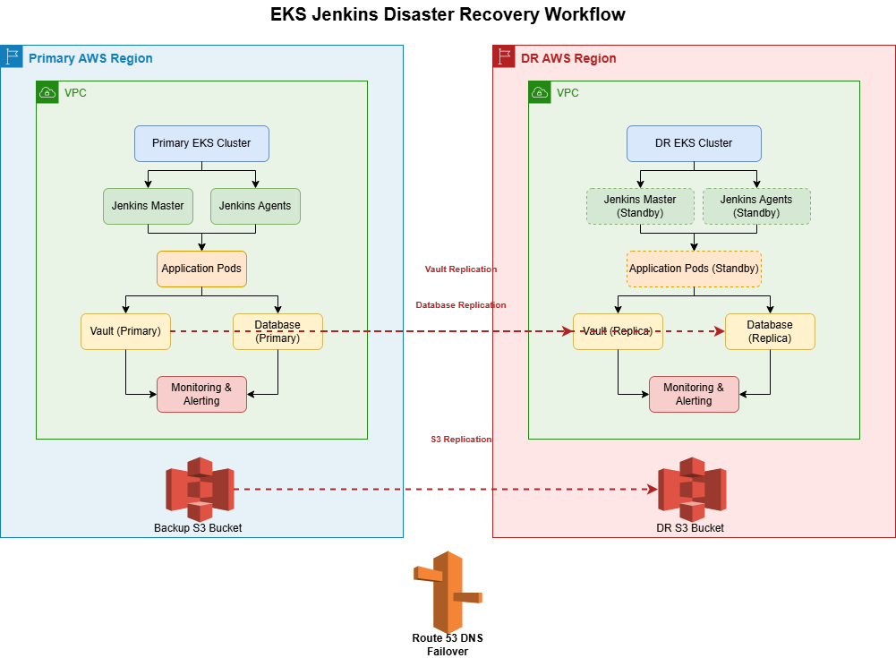

# AWS Infrastructure with EKS, Jenkins, and BitBucket CI/CD

## Architecture Overview

This project implements a comprehensive cloud infrastructure solution using AWS services, Kubernetes (EKS), Jenkins CI/CD, and BitBucket integration. The architecture is designed with multi-environment support including development, production, and disaster recovery capabilities.

## System Architecture

Key Components

1. **Network Infrastructure**

   * **VPC Architecture**: Each environment has its own isolated VPC
   * **Subnet Design**:
     - Public subnet for internet-facing components
     - Private subnet for application workloads
     - Dedicated subnet for databases and persistent storage
   * **Network Security**: Security groups and NACLs for defense-in-depth
   * **Internet Connectivity**: NAT Gateways for private instances, Internet Gateways for public resources
2. **Kubernetes Cluster Architecture**

   * **Environment-Specific EKS Clusters**:
     - **Development**: Right-sized resources optimized for rapid iteration
     - **Production**: Highly available, scaled for performance and reliability
     - **Disaster Recovery**: Pilot-light implementation in a separate region
   * **Node Group Configuration**:
     - Production: On-demand instances for reliability
     - DR: Cost-effective spot instances that convert to on-demand during failover
3. **CI/CD Pipeline Architecture**

   * **Jenkins Implementation**:
     - Controller deployed on Kubernetes for high availability
     - Dynamic agent scaling based on workload requirements
     - Kubernetes-native integration
   * **Pipeline Separation**:
     - Infrastructure pipeline for AWS resource provisioning
     - EKS pipeline for cluster management
     - Application pipeline for containerized software deployment
4. **Resilience and High Availability**

   * **Multi-AZ Configuration**: Resources distributed across availability zones
   * **Disaster Recovery Strategy**:
     - Pilot-light DR environment in secondary region
     - Automatic failover using Route 53 health checks
     - Lambda-based DR activation that scales up resources during failover
5. **Observability Framework**

   * **Monitoring Stack**:
     - Prometheus for metrics collection
     - Grafana for visualization and alerts
     - Rancher for cluster management and observability
   * **Health Checks**: Route 53 health monitoring for critical endpoints
6. **Content Delivery**

   * **CloudFront Distribution**: Global content delivery and caching
   * **Load Balancing**: Application Load Balancers for traffic management

## Logical Architecture

The architecture follows a multi-tier design pattern:

1. **Presentation Tier**:

   * Application Load Balancers
   * CloudFront CDN
2. **Application Tier**:

   * EKS-hosted containerized applications
   * Auto-scaling node groups
3. **Data Tier**:

   * Dedicated subnet for database services
   * S3 buckets for object storage
4. **DevOps Tier**:

   * Jenkins CI/CD platform
   * BitBucket integration
   * Terraform infrastructure as code
5. **Management Tier**:

   * Prometheus and Grafana for monitoring
   * Rancher for Kubernetes management

## Security Architecture

* IAM roles with least privilege principle
* Network segmentation via VPC design
* EKS security groups and pod security policies
* Secrets management through HashiCorp Vault

## Integration Points

* BitBucket for source code management
* AWS services for infrastructure components
* Jenkins for orchestration and deployment
* Kubernetes for application runtime

## Deployment Process Flow

The deployment follows a structured flow across environments:

1. Code is committed to BitBucket repository
2. Jenkins pipelines triggered based on branch/environment
3. Infrastructure provisioned or updated via Terraform
4. Container images built and pushed to ECR
5. Applications deployed to appropriate EKS cluster
6. Monitoring verifies successful deployment

For detailed implementation instructions, please refer to the [USAGE.md](USAGE.md) document.

